# Tensor-Var: Efficient four-dimensional variational data assimilation

### Abstract 
Variational data assimilation estimates the dynamical system states by minimizing cost function that fits the numerical models with observational data. The widely used method, four-dimensional variational assimilation (4D-Var), has two primary limitations: (1) computationally demanding for complex nonlinear systems; and (2) relying on state-observation mappings, which are often impractical. Recently, deep learning (DL) has been used as a more expressive class of efficient model approximators to address these challenges. However, integrating such models into 4D-Var remains challenging due to their inherent nonlinearities and the lack of theoretical guarantees for consistency in assimilation results. In this paper, we propose $\textit{Tensor-Var}$ to address these challenges using kernel Conditional Mean Embedding (CME). Tensor-Var characterizes system dynamics and state-observation mappings as linear operators in a feature space, enabling a more efficient linear 4D-Var framework. Our method seamlessly integrates CME with 4D-Var, offering theoretical guarantees of consistent assimilation results between the original and feature space. To improve CME scalability, we use deep kernel features that map data into a finite-dimensional feature space, utilizing the expressiveness of deep learning. Experiments on chaotic systems and global weather forecasting demonstrate that Tensor-Var outperforms operational and DL hybrid methods 4D-Var baselines in terms of accuracy while achieving efficiency comparable to the static 3D-Var method.

### Qualitative Results
|    |Ground Truth|Observation|Tensor-Var| 
|---------------|----------------------------------|----------------------------------|----------------------------------|
|Geopotential| 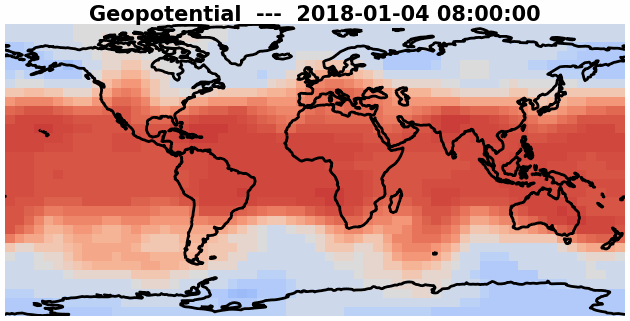 |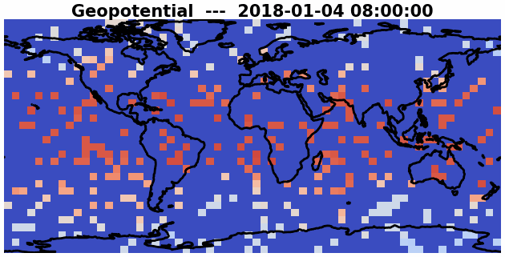 |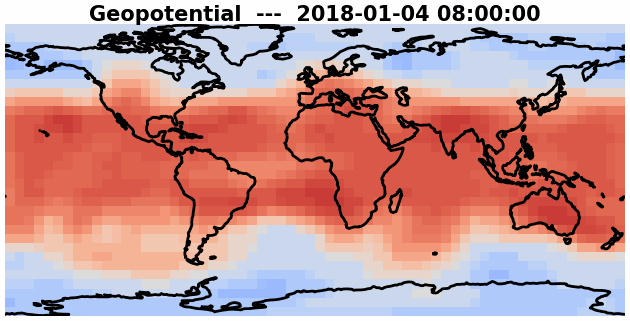 |   
|Temperature| 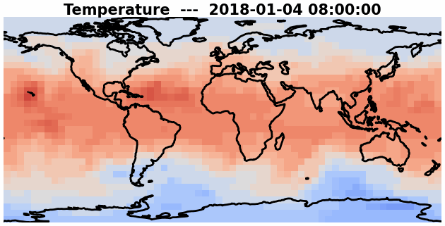 |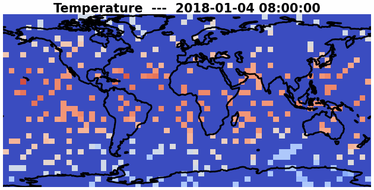 | 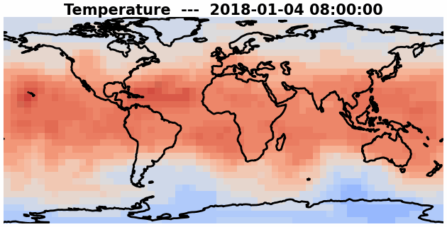|   
|Humidity| 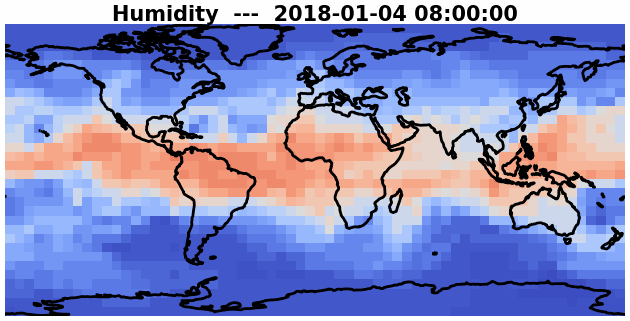 |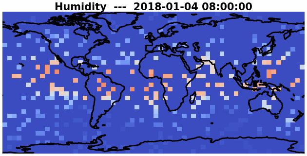 | 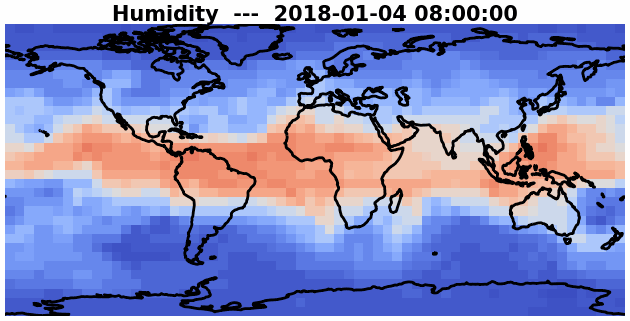|   
|Wind U-direction| 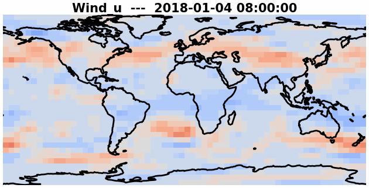 | 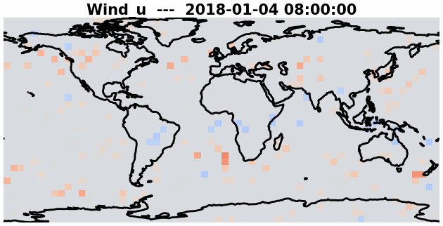 | 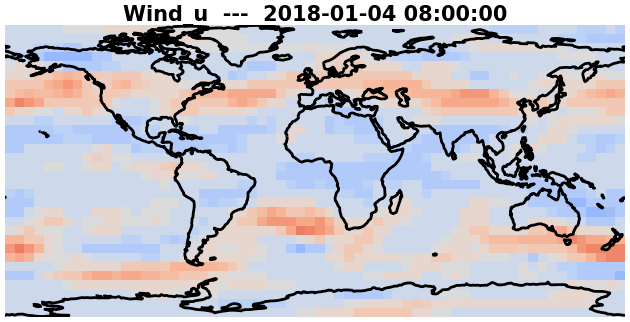|   
|Wind V-direction| 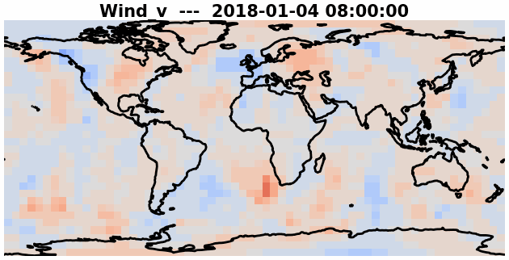 | 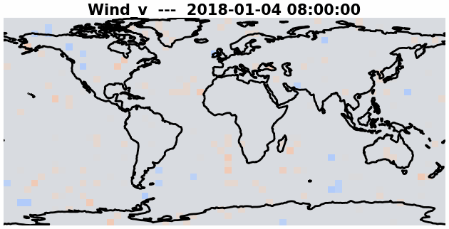| 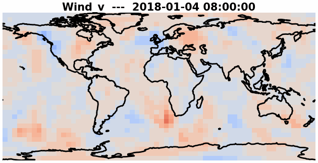|   


### Code Structure 
- model
    - utils
        - utils.py
        - model_utils.py
    - base.py
    - KS_model.py
    - Lorenz_model.py
    - ERA5_model.py
    
- training_scripts
    - Task folder
        - config.yaml
        - train_task.py
- var_opt
    - LBFGS_Var.py
    - Tensor_Var.py

- example 
    - KS.ipynb
    - ERA5.ipynb
    - L96.ipynb

- dataset.py
- train.py
- utils.py


### Install Dependencies
``` 
pip install -U -r requirements.txt
```
or 
``` 
conda env create -f environment.yml
conda activate tensor-var
``` 
*Note: You may need to install pytorch seperately for GPU support: 

``` pip install torch torchvision torchaudio --index-url https://download.pytorch.org/whl/cu121``` 


## Contact
For questions and feedback, feel free to reach out: Yiming Yang (zcahyy1@ucl.ac.uk)

If you encounter any issues, please open an issue on GitHub.